<div align="center">
  
  
  
  
  
  
</div>

<br />

<div align="center">
  <h1 align="center">🔐 Secure P2P Chat 🌌</h1>
  <p align="center">
    <em>Quantum-resistant, military-grade P2P communication with multi-layered cryptographic protection. Your digital sanctum in the post-quantum era.</em>
    <br />
    <br />
    <a href="#🏗️-architecture"><strong>Dive into the Architecture »</strong></a>
    <br />
    <br />
    <a href="#⚙️-setup-and-running">Launch Guide</a>
    ·
    <a href="#📈-security-flow-summary">Decipher the Flow</a>
    ·
    <a href="#🧩-module-breakdown--network-stages">Explore Modules</a>
  </p>
</div>

---

## ✨ Highlights

- **🛡️ Quantum-Hardened Cryptography**: Fortified with X25519, ML-KEM-1024, and FALCON-1024 for next-generation threat resilience.
- **🧅 Deep Encryption Layers (4x)**: Independent strata of protection including TLS 1.3, Double Ratchet, application-specific ciphers, and encrypted certificate exchange.
- **👁️‍🗨️ Advanced Anonymity Shield**: Sophisticated traffic analysis countermeasures and message length obfuscation.
- **⚙️ Seamless Hardware Security**: Integrates with platform-native secure elements like TPM (Windows) and HSMs (Linux/macOS).
- **🔑 Unyielding Forward Secrecy & Post-Compromise Security**: Employs automatic key rotation and robust break-in recovery protocols.
- **💨 Ephemeral Zero-Trace Mode**: Optional in-memory operation ensures no persistent data footprint.
- **💻 Universal Platform Compatibility**: Engineered for flawless operation across Windows, macOS, and Linux ecosystems.

---

## 📜 Table of Contents

- [About The Project](#about-the-project-engineering-digital-sovereignty)
- [Architecture](#architecture-a-blueprint-for-unbreakable-trust)
- [Security Features In-Depth](#security-features-in-depth-pillars-of-a-quantum-resistant-fortress)
  - [Hybrid Post-Quantum Cryptography](#hybrid-post-quantum-cryptography-bridging-classical--quantum-resilience)
  - [Multi-Layered Encryption](#multi-layered-encryption-a-concentric-shield-of-confidentiality)
  - [Hardware Security Integration](#hardware-security-integration-anchoring-trust-in-silicon)
  - [Secure Key Management](#secure-key-management-a-vault-for-cryptographic-secrets)
  - [Layered Security Model Diagram](#layered-security-model-diagram-visualizing-the-defense-cascade)
- [Module Breakdown & Network Stages](#module-breakdown--network-stages-deconstructing-the-digital-fortress)
- [Security Flow Summary](#security-flow-summary-the-journey-of-a-protected-message)
- [Advanced Protection Features](#advanced-protection-features-securing-the-unseen--unforeseen)
  - [Traffic Analysis Resistance](#traffic-analysis-resistance-cloaking-digital-footprints)
  - [Double Ratchet Enhancement](#double-ratchet-enhancement-next-generation-secure-messaging-core)
  - [Anti-Forensic Design](#anti-forensic-design-vanishing-digital-traces)
  - [Security Monitoring](#security-monitoring-vigilant-sentinel-protocols)
  - [Ephemeral Identities](#ephemeral-identities-dynamic-anonymity--untraceability)
- [Setup and Running](#setup-and-running-igniting-your-secure-channel)
- [Under The Hood: Technical Deep Dive](#under-the-hood-technical-deep-dive)
- [Dependencies](#dependencies-the-building-blocks-of-security)
- [Potential Use Cases](#potential-use-cases-securing-tomorrows-sensitive-communications)
- [Roadmap: The Future Unveiled](#roadmap-the-future-unveiled)
- [Contributing to the Frontier](#contributing-to-the-frontier)
- [Security Considerations & Disclaimers](#security-considerations--disclaimers)
- [License](#license)
- [Acknowledgments & Inspirations](#acknowledgments--inspirations)

---

## 🚀 About The Project: Engineering Digital Sovereignty

This initiative pioneers a new echelon of secure peer-to-peer communication, architected to withstand both contemporary and emergent quantum threats. It is a testament to proactive defense in an evolving digital landscape.

**Recent Developments (June 2025):** Successfully resolved a critical issue in the certificate exchange mechanism, ensuring robust ChaCha20Poly1305 encryption with proper key derivation (HKDF-SHA256) and error handling. This fix has enhanced the reliability and security of the initial peer authentication process, leading to stable end-to-end secure communication across all layers.

### 🛡️ Recent Security Fortifications (Post-June 2025 Audit)

Following a comprehensive security review, several key enhancements have been integrated to further bolster the application's defenses:

1.  **Enhanced Secure Key Wiping**:
    *   **Accurate Handling of Immutable Keys**: The `KeyEraser` (in `secure_p2p.py`) and `_secure_wipe_memory` (in `tls_channel_manager.py`) now correctly distinguish between mutable `bytearray` and immutable `bytes` objects. For `bytes`, they log an informational message about the inability to wipe in-place, preventing a false sense of security.
    *   **Memory Pinning for Sensitive Data**: For mutable `bytearray` objects containing key material, the system now employs `mlock()` (on POSIX systems) or `VirtualLock()` (on Windows) to pin the memory region in RAM. This significantly reduces the risk of sensitive key data being swapped to disk before it can be securely zeroized. Zeroization is performed using `ctypes.memset` for efficiency, followed by unpinning the memory.

2.  **End-to-End Authentication of Key Exchange**:
    *   **Addressing "No Authentication of First Message"**: A critical step has been added to authenticate the final derived `hybrid_root_key` (from the Hybrid X3DH+PQ exchange) before the Double Ratchet protocol is instantiated.
    *   **Mechanism**: Both client and server now:
        *   Hash their locally derived `hybrid_root_key` using SHA256.
        *   Sign this hash using their long-term FALCON-1024 digital signature private key.
        *   Exchange these hashes and signatures.
        *   Verify the peer's signature on the hash, and critically, verify that the peer's hash matches their own locally computed hash of the `hybrid_root_key`.
    *   **Impact**: This ensures that both parties have cryptographically agreed upon the same `hybrid_root_key` and that this agreement is bound to their authenticated long-term identities, mitigating sophisticated Man-in-the-Middle (MitM) attacks that could target the key exchange process itself.

These updates substantially strengthen the application's security posture against advanced threats, particularly concerning key management in memory and the integrity of the cryptographic handshake.

### 🌟 Signature Capabilities

This platform distinguishes itself through a potent combination of advanced security technologies:

*   **Core Cryptographic Shield**:
    *   **Hybrid X3DH+PQ Key Exchange**: Merges the battle-tested X3DH with the quantum-resistant ML-KEM-1024, establishing a forward-secret and quantum-hardened initial shared secret.
    *   **FALCON-1024 Signatures**: Provides high-assurance, quantum-resistant authentication for identities and critical data.
*   **Resilience & Confidentiality**:
    *   **Multi-Strata Encryption**: Deploys distinct encryption across TLS 1.3, the Double Ratchet, application data, and certificate exchanges.
    *   **Dynamic Identity Management**: Features automatic rotation of cryptographic identities for enhanced anonymity and untraceability.
*   **Stealth & Evasion**:
    *   **Advanced Obfuscation Techniques**: Implements sophisticated measures to resist traffic analysis and conceal message metadata.
    *   **Zero-Footprint Operation**: Offers an optional in-memory mode that leaves no data on persistent storage.
*   **Platform & Integration**:
    *   **Universal HSM/TPM Interface**: Abstracts hardware security operations for seamless cross-platform functionality.
    *   **Robust Memory Safeguards**: Incorporates security-hardened memory management, including canary values and secure wiping.

---

## 🏗️ Architecture: A Blueprint for Unbreakable Trust

The application's design embodies a paradigm of defense-in-depth, orchestrating multiple specialized modules to forge a resilient security posture. Each component is meticulously engineered to contribute to the overall integrity and confidentiality of the communication channel.


---

## 🛡️ Security Features In-Depth: Pillars of a Quantum-Resistant Fortress

This section dissects the core security mechanisms that establish the foundation of trust and resilience within the application.

### 🛡️ Hybrid Post-Quantum Cryptography: Bridging Classical & Quantum Resilience

The system pioneers a hybrid cryptographic model, synergizing battle-hardened classical algorithms with cutting-edge post-quantum cryptography (PQC) to deliver robust security against diverse adversarial capabilities, both present and future.

- **Quantum-Resistant Key Exchange (KEM)**: Utilizes **X25519 Diffie-Hellman** for its proven efficiency and security in the classical realm, combined with **ML-KEM-1024 (CRYSTALS-Kyber)**, a NIST-selected PQC algorithm, for encapsulating a shared secret resistant to quantum attacks. This dual approach ensures that compromising one primitive does not compromise the entire key exchange.
  - **Precision HKDF for Root Key Generation**: The combined shared secret derived from X25519 and ML-KEM-1024 is meticulously processed using **HKDF (HMAC-based Key Derivation Function) with SHA-512**. A specific, unambiguous `info` string (`b'Hybrid X3DH+PQ Root Key'`) is employed to cryptographically bind the derivation to its intended purpose, generating the session's master root key.
  - **Rigorous Post-Quantum Ciphertext Validation**: Incoming ML-KEM-1024 ciphertexts are strictly validated against the expected size (`MLKEM1024_CIPHERTEXT_SIZE`). The underlying `quantcrypt` library's decapsulation process performs further cryptographic checks, ensuring ciphertext integrity. Any validation failure or decryption error is robustly handled to prevent protocol vulnerabilities.
  - **Cryptographic Binding of EC & PQ Components**: To thwart sophisticated mix-and-match or cross-protocol attacks, ephemeral Elliptic Curve (EC) public keys and Post-Quantum (PQ) KEM ciphertexts are cryptographically bound. This is achieved by signing the concatenation of the ephemeral EC public key and the KEM ciphertext with an **ephemeral FALCON-1024 signature**. This `ec_pq_binding_sig` ensures that the EC and PQ components originated from the same, legitimate handshake participant.
  - **Proactive Signature Key Ephemerality**: To mitigate risks associated with signature key reuse (such as side-channel attacks or future algorithmic breaks against static keys), each handshake transaction employs a **freshly generated, ephemeral FALCON-1024 key pair** for signing handshake elements (e.g., the EC-PQ binding). The longer-term identity FALCON key is only used to certify these short-lived ephemeral FALCON public keys. In the system's default ephemeral identity mode, even these main identity FALCON keys are subject to periodic rotation, further enhancing security.
- **Quantum-Resistant Digital Signatures**: Employs **FALCON-1024**, another NIST-selected PQC algorithm, for digital signatures. This provides high-assurance authentication for identities and critical data, resistant to attacks by quantum computers.
- **Dual Security Advantage**: This hybrid strategy ensures that the communication remains secure even if one class of cryptographic algorithms (either classical or post-quantum) is unexpectedly compromised in the future. It represents a forward-thinking approach to enduring data protection.

### 🔄 Multi-Layered Encryption: A Concentric Shield of Confidentiality

The application wraps user data in four distinct and independent encryption layers, each contributing unique security properties to achieve true defense-in-depth:

1.  **🌐 Transport Layer Security (TLS 1.3)**: Establishes a secure, mutually authenticated, and encrypted tunnel between peers.
    *   **Post-Quantum Readiness**: Enhanced with a preference for Post-Quantum KEMs (like ML-KEM used with X25519) via TLS 1.3's `key_share` groups when available and supported by the underlying SSL library.
    *   **Rigorous Certificate Validation**: Performs strict validation of peer certificates against a provided CA or self-signed certificates exchanged during the initial handshake.
    *   **Verified Perfect Forward Secrecy (PFS)**: TLS 1.3 mandates PFS for its standard cipher suites. The application further includes explicit logging to verify that an ephemeral key exchange mechanism (e.g., ECDHE) was indeed negotiated during the handshake, providing an auditable assurance that session keys cannot be compromised even if long-term identity keys are.
    *   **DANE Validation Scaffolding & DNSSEC Consideration**: The `tls_channel_manager.py` module now incorporates parameters (`dane_tlsa_records`, `enforce_dane_validation`) and internal logic to perform DANE (DNS-Based Authentication of Named Entities) validation of peer certificates against TLSA records. While the application can process these records if provided, for comprehensive protection against DNS spoofing attacks, the secure retrieval of these TLSA records via DNSSEC (DNS Security Extensions) is crucial. Implementing DNSSEC resolution is a broader operational consideration typically handled at the OS or network infrastructure level, or via specialized DNS client libraries.
2.  **✉️ Double Ratchet Protocol**: Provides cutting-edge end-to-end encryption for message content, delivering robust forward secrecy and post-compromise security. (Refer to the "Double Ratchet Enhancement" section for more granular details on its advanced features).
3.  **📦 Application-Layer Safeguards**: Offers an additional, configurable layer of encryption for the message payload itself, using ciphers like XChaCha20-Poly1305 or AES-256-GCM before it even enters the Double Ratchet pipeline.
4.  **📜 Encrypted Certificate Exchange**: During the initial peer authentication, certificate data is exchanged over a dedicated, encrypted channel.
    -   **Robust Encryption**: This exchange is secured using **ChaCha20-Poly1305**.
    -   **Fortified Key Derivation**: The 32-byte key required for ChaCha20-Poly1305 encryption is meticulously derived using **HKDF-SHA256** (with SHA-256 as the hash function) from a pre-shared context string (`b'SecureP2PCertificateExchangeKey!!'` combined with a salt). This ensures adherence to the cipher's strict key length requirements, averting vulnerabilities tied to incorrect key sizing.
    -   **Strict Error Handling**: Any failure during the encryption or decryption of certificate data (e.g., due to key errors or corrupted data) immediately aborts the certificate exchange process. This prevents the connection from proceeding with potentially unverified or unencrypted peer certificates, thereby maintaining the integrity of the secure channel establishment.

### 🖥️ Hardware Security Integration: Anchoring Trust in Silicon

A cross-platform abstraction layer facilitates interaction with hardware-based secure elements, significantly elevating key protection:

- **Platform-Native Modules**: Seamlessly integrates with **Windows CNG (Cryptography API: Next Generation) using TPM 2.0** and with **PKCS#11-compliant Hardware Security Modules (HSMs)** on Linux and macOS.
- **Hardware-Protected Capabilities**: Enables critical cryptographic operations to be performed within the secure boundary of the hardware module:
    - **Secure Key Generation**: Cryptographic keys can be generated directly within the HSM/TPM.
    - **Protected Signing Operations**: Private keys used for signing can be non-exportable and remain within the hardware, mitigating key theft.
    - **Hardware-Derived Randomness**: Leverages high-quality entropy from hardware random number generators (RNGs) where available.

### 🔐 Secure Key Management: A Vault for Cryptographic Secrets

The system employs advanced strategies for managing cryptographic keys, tailored to OS-specific best practices and threat models:

- **Versatile Storage Backends**:
    - **OS-Native Keyrings**: Utilizes Windows Credential Manager, macOS Keychain, and Linux Keyring for secure, OS-managed storage.
    - **Fortified Filesystem Storage**: Employs OS-specific secure locations with rigorously enforced permissions for file-based key storage.
    - **Ephemeral In-Memory Storage**: Offers a zero-persistence mode where all keys reside exclusively in protected RAM, leaving no trace upon termination.
- **Enhanced Process Security (POSIX)**: On POSIX-compliant systems (Linux/macOS), key management operations can be isolated in a separate, dedicated process, minimizing the attack surface.
- **Advanced Memory Defenses**: Implements robust memory protection mechanisms, including secure wiping of sensitive data from memory, strategic placement of canary values to detect unauthorized memory modifications, and anti-debugging techniques.

### 🛡️ Layered Security Model Diagram: Visualizing the Defense Cascade

The application employs multiple layers of security to protect data in transit. The following diagram illustrates how a user's message is encapsulated:

```mermaid
%%{init: {'theme': 'dark', 'themeVariables': { 'fontFamily': 'Arial, sans-serif'}}}%%
graph LR
    subgraph "🌍 Network Transmission (OS Kernel)"
        TCPIP>"TCP/IP Frame<br/>(Contains Encrypted TLS Record)"]
    end
    subgraph "🔒 Transport Layer Security (TLS 1.3 Channel)"
        TLS_Packet>"TLS Record<br/>(Contains Encrypted Double Ratchet Message)"]
    end
    subgraph "✉️ End-to-End Encrypted Message (Double Ratchet)"
        DR_Message>"Double Ratchet Message<br/>(Header + Encrypted Padded User Data + Signature)"]
    end
    subgraph "📝 Application Data Preparation"
        Padded_Message>"Padded User Message<br/>(Random Padding Bytes + Original Message Bytes)"]
        User_Message[("Original User Message<br/>(Plaintext String)")]
    end

    User_Message -- "UTF-8 Encode & Add Random Padding<br/>(`_add_random_padding`)" --> Padded_Message
    Padded_Message -- "Double Ratchet Encryption<br/>(`ratchet.encrypt`)" --> DR_Message
    DR_Message -- "TLS Encryption (SSL Socket)" --> TLS_Packet
    TLS_Packet -- "TCP/IP Framing (OS Network Stack)" --> TCPIP

    subgraph "🤝 Handshake Protocols (Establish & Secure Layers)"
      direction TB
      CertEx["Certificate Exchange<br/>(`ca_services.py`)<br/>(Secures TLS identity)"]
      HybridKEX["Hybrid X3DH+PQ KEX<br/>(`hybrid_kex.py`)<br/>(Establishes DR root key)"]
      DRSetup["DR Initialization<br/>(`double_ratchet.py`)<br/>(Initial DR state)"]
      TLSHandshake["TLS 1.3 Handshake<br/>(`tls_channel_manager.py`)<br/>(Establishes secure channel)"]
    end
    
    CertEx ==> TLSHandshake
    HybridKEX ==> DRSetup
    DRSetup ==> DR_Message
    TLSHandshake ==> TLS_Packet

    classDef data fill:#283747,stroke:#5DADE2,stroke-width:2px,color:#FDFEFE;
    classDef handshake_protocol fill:#212F3C,stroke:#A569BD,stroke-width:2px,color:#FDFEFE;
    classDef protocol_node fill:#4A235A,stroke:#D2B4DE,stroke-width:2px,color:#FDFEFE;

    class User_Message,Padded_Message,DR_Message,TLS_Packet,TCPIP data;
    class CertEx,HybridKEX,DRSetup,TLSHandshake handshake_protocol;

    linkStyle default stroke:#ABB2B9,stroke-width:2px;
```


This layered approach ensures that even if one layer is compromised, others remain to protect the communication.

---

## 🚀 Advanced Protection Features: Securing the Unseen & Unforeseen

Beyond the foundational security layers, the application incorporates specialized mechanisms to counter sophisticated threats and enhance operational stealth.

### 📊 Traffic Analysis Resistance: Cloaking Digital Footprints

To thwart eavesdroppers attempting to deduce information from encrypted traffic patterns, the system employs multi-faceted obfuscation strategies:

- **Dynamic Byte-Level Padding**: Before entering the Double Ratchet encryption pipeline, `secure_p2p.py` injects a variable amount of random padding (0-15 bytes, plus a 1-byte length indicator) into each message. This initial randomization diversifies the plaintext size before it encounters the more substantial overheads of the Double Ratchet.
- **Uniform Ciphertext Profile via Protocol Overheads**: The Double Ratchet protocol itself, with its requisite headers (often including ephemeral public keys for ratchet steps) and large FALCON-1024 signatures (approximately 1270 bytes for authenticating each message), naturally standardizes the final ciphertext size. This means that short user messages, system heartbeats, or even moderately sized communications tend to produce encrypted packets of a broadly similar length (e.g., ~1350-1420 bytes). This inherent property significantly complicates attempts to differentiate message types or infer content length based purely on observed network packet sizes.
- **Encrypted Heartbeats & Control Messages**: System-level messages, such as keepalives, are also fully encrypted, rendering them indistinguishable from actual user data on the wire.

### 🔄 Double Ratchet Enhancement: Next-Generation Secure Messaging Core

The implementation significantly advances the conventional Double Ratchet paradigm by integrating post-quantum elements and fortifying key derivation processes:

- **Synergistic Post-Quantum Ratcheting**: Incorporates **ML-KEM-1024** for deriving fresh cryptographic entropy during designated ratchet steps, infusing the session with quantum-resistant randomness alongside traditional Diffie-Hellman exchanges.
- **Quantum-Secure Authentication**: Leverages **FALCON-1024 signatures** to authenticate every message transmitted within the Double Ratchet's end-to-end encrypted channel, ensuring message integrity and sender authenticity against quantum adversaries.
- **Ironclad Key Derivation Framework**:
    - **Rigorous HKDF Domain Separation**: While the initial `hybrid_root_key` is sourced from the Hybrid KEX, *all subsequent key derivations* within the Double Ratchet (for updating root keys, generating sending/receiving chain keys, and deriving message keys) are governed by **HKDF-SHA512**. A meticulously designed system of unique, purpose-specific `info` strings (e.g., `DR_ROOT_UPDATE_HYBRID_MLKEM1024_DH_v2`, `DR_CHAIN_INIT_SEND_X25519_v2`, `KDF_INFO_MSG_AES_KEY_v3`) is employed. This ensures absolute cryptographic separation between keys used for different purposes, preventing any potential cross-context attacks or inadvertent key reuse.
    - **Independent Message Key Generation**: Message keys are derived from their respective chain keys using **HMAC-SHA256**. Crucially, distinct HMAC operations with different constant `info` strings (effectively acting as separate HMAC keys, e.g., `self.KDF_INFO_MSG` for message keys and `self.KDF_INFO_CHAIN` for the next chain key) are used. This provides strong cryptographic independence between a message key and the subsequent chain key, a more robust approach than relying solely on counter-based KDF inputs for this critical step.
    - **KDF Resilience by Design**: The primary internal Key Derivation Function (`_kdf`) utilizes the standard extract-then-expand paradigm of HKDF-SHA512. It derives a salt from the `key_material` (typically a root key) and processes the main Input Keying Material (IKM) – from DH outputs or KEM decapsulations. This construction offers inherent resilience against variations or potential "unusual alignments" in the IKM, provided the underlying cryptographic primitives (X25519, ML-KEM, SHA-512) remain secure.
- **Hardened Memory Management**: Sensitive ratchet state variables are stored in protected memory regions, with provisions for secure wiping upon disuse, safeguarding against sophisticated memory forensic techniques.
- **Proactive Replay Attack Neutralization**: A dedicated replay cache (`self.processed_message_ids`), implemented as a `collections.deque` with a configurable maximum size (`MAX_REPLAY_CACHE_SIZE`), meticulously tracks recently received message IDs. Any attempt to replay a previously processed message ID results in immediate rejection of the message and the raising of a `SecurityError`. This robustly defends against attackers replaying captured ciphertexts to induce duplicate message processing or expose previously decrypted plaintexts.

### 👻 Anti-Forensic Design: Vanishing Digital Traces

Engineered with features to minimize persistent data and elude forensic scrutiny:

- **Volatile In-Memory Operation**: A dedicated mode allows all cryptographic keys and sensitive state to exist exclusively in RAM, ensuring no data is written to disk, thus leaving no persistent artifacts upon session termination or system shutdown.
- **Aggressive Secure Memory Wiping**: Implements explicit and verified memory clearing routines for all sensitive data structures before they are deallocated, overwriting them with random patterns to thwart recovery.
- **Fluid Ephemeral Identities**: The system's capability for automatic and frequent rotation of all cryptographic identifiers (keys, certificates) means that even if one session's metadata were compromised, it would not link to past or future activities, fragmenting the attacker's view.
- **Decentralized, Serverless Architecture**: The inherent P2P design avoids central servers, eliminating single points of failure and large repositories of user metadata that could be targeted.

### 🔍 Security Monitoring: Vigilant Sentinel Protocols

The application integrates several mechanisms for continuous security vigilance and integrity verification:

- **Cryptographic Entropy Audits**: Verifies that all generated cryptographic materials (keys, nonces, salts) meet stringent randomness criteria, crucial for the security of underlying algorithms.
- **Memory Integrity Canaries**: Strategically placed canary values in memory segments holding sensitive data act as tripwires, allowing detection of unauthorized modifications or buffer overflow attempts.
- **Encrypted & Authenticated Heartbeats**: Regular keepalive messages are not only encrypted but also authenticated, ensuring the integrity of the connection and preventing sophisticated session hijacking attempts via spoofed control messages.
- **Behavioral Anomaly Detection**: Internal heuristics monitor protocol states and cryptographic operations for deviations from expected behavior, flagging potential security events or malfunctions for logging and potential intervention.
- **Granular Decryption Logging**: Provides detailed logs for the decryption process, including the size of incoming ciphertext and the size of the plaintext after padding removal. This aids in monitoring traffic characteristics and diagnosing potential issues or anomalies.

### 🆔 Ephemeral Identities: Dynamic Anonymity & Untraceability

This feature significantly bolsters user privacy and frustrates long-term tracking efforts:

- **Automated Identity Morphing**: All core cryptographic identifiers, including key pairs and associated certificates, are designed for seamless, automatic rotation at user-configurable intervals (e.g., hourly, daily). This creates a constantly shifting identity landscape.
- **Absence of Static Long-Term Identifiers**: The system consciously avoids reliance on fixed, long-term identifiers that could serve as anchor points for tracking user activity across multiple sessions or over extended periods.
- **Session Unlinkability**: Each new communication epoch can appear to originate from a cryptographically distinct and unrelated identity, making it exceptionally challenging to correlate sessions or construct a persistent profile of a user's communication patterns.
- **Elevated Anonymity Posture**: This dynamic identity management complements other encryption and obfuscation layers, significantly raising the bar for adversaries attempting to attribute communications to specific individuals or entities over time.

---

## 🧩 Module Breakdown & Network Stages: Deconstructing the Digital Fortress

The application's sophisticated security architecture is realized through a synergistic interplay of specialized Python modules. Each module governs distinct functionalities and network stages, contributing to the overall defense-in-depth strategy.

### 1. `p2p_core.py` - 🌐 Foundational P2P Networking Matrix
- **Core Function**: Manages fundamental TCP/IPv6 network interactions, NAT traversal via STUN (Session Traversal Utilities for NAT), and low-level message framing (prefixing messages with their length for reliable segmentation and reassembly).
- **Security Role**: Provides the bedrock communication channel over which all encrypted and authenticated data flows. While not performing encryption itself, its reliability is crucial for the integrity of the overlying secure protocols.
- **Network Phase**: Initial peer discovery, connection establishment, and raw byte stream transport.

### 2. `platform_hsm_interface.py` (alias `cphs`) - 🛡️ Unified Hardware Security Gateway
- **Core Function**: Delivers a standardized, cross-platform interface to hardware-based cryptographic acceleration and secure key storage.
- **Security Role**: Bridges software operations with silicon-level trust anchors. Manages interaction with Windows TPM 2.0 (via CNG) and PKCS#11-compliant HSMs (Linux/macOS).
- **Key Capabilities**: Secure key generation, hardware-protected signing, access to hardware RNGs, and management of keys within secure hardware boundaries.

### 3. `secure_key_manager.py` - 🔑 Cryptographic Key Custodian
- **Core Function**: Provides robust, cross-platform services for the secure storage, retrieval, and lifecycle management of cryptographic keys.
- **Security Role**: Protects the most critical assets of the system. Offers multiple backends including OS-native keyrings, encrypted files, and ephemeral in-memory storage.
- **Key Features**: Employs process isolation (POSIX), strict filesystem permissions, and advanced memory protection techniques for keys under its management.

### 4. `ca_services.py` - 📜 Identity & Certificate Authority Services
- **Core Function**: Handles the generation of self-signed X.509 certificates, secure exchange of these certificates between peers, and their cryptographic verification.
- **Security Role**: Establishes initial authenticated identities for peers, forming a basis for trust in subsequent secure channel establishments (e.g., TLS). Protects certificate data in transit using ChaCha20-Poly1305, with keys derived via HKDF.
- **Key Features**: Enforces strong cryptographic parameters for certificates, performs mutual authentication during exchange, and ensures robust error handling.

### 5. `hybrid_kex.py` - 🗝️ Advanced Hybrid Key Exchange Orchestrator
- **Core Function**: Implements the Extended Triple Diffie-Hellman (X3DH) key agreement protocol, augmented with post-quantum cryptographic primitives (ML-KEM-1024 and FALCON-1024).
- **Security Role**: Establishes the initial shared secret key that bootstraps the Double Ratchet encryption. Its hybrid nature (X25519 + ML-KEM) provides resilience against both classical and quantum cryptanalytic threats.
- **Key Components**: Manages static, signed, and ephemeral key pairs, incorporating quantum-resistant KEMs for encapsulation and FALCON signatures for authentication of exchange components.

### 6. `tls_channel_manager.py` - 🔒 Quantum-Ready TLS Channel Controller
- **Core Function**: Manages the establishment, maintenance, and termination of TLS 1.3 secure communication channels between peers.
- **Security Role**: Provides a secure transport layer, encrypting all P2P traffic after initial handshakes. Prefers cipher suites with post-quantum KEMs if supported by peers and available.
- **Key Features**: Enforces certificate pinning (using certificates from `ca_services.py`), mandates strong cipher suites (e.g., ChaCha20-Poly1305, AES-256-GCM), and handles TLS session parameters.

### 7. `double_ratchet.py` - 📨 Next-Generation End-to-End Encryption Engine
- **Core Function**: Implements an advanced Double Ratchet algorithm for highly secure, asynchronous messaging with strong forward and post-compromise security.
- **Security Role**: Provides the primary end-to-end encryption for user messages. Features post-quantum enhancements through ML-KEM for entropy infusion and FALCON-1024 for message authentication.
- **Key Features**: Sophisticated key derivation schedules, per-message keying, handling of out-of-order messages, replay attack prevention, and obfuscation of message metadata.

### 8. `secure_p2p.py` - 🤖 Central Security Orchestration & User Nexus
- **Core Function**: Acts as the central nervous system of the application. It coordinates the sequential initialization and operation of all security modules, manages application state, and provides the interface for user interaction.
- **Security Role**: Ensures the correct and secure orchestration of the entire defense-in-depth architecture, from initial connection to message exchange and termination. It is responsible for enforcing security policies and managing transitions between different security states.
- **Key Responsibility**: Guarantees the integrity of the overall security process flow, verifying outputs from each module before proceeding to the next stage, and handling user commands within the established secure context.

---

## 📈 Security Flow Summary: The Journey of a Protected Message

The establishment of a secure communication channel and subsequent message exchange follows a meticulously choreographed sequence of cryptographic operations:

1.  **🌐 Peer Discovery & Network Link-Up**:
    *   Peers utilize STUN to ascertain their public IP addresses and port mappings, enabling NAT traversal.
    *   A foundational TCP/IP connection is established, forming the raw transport conduit.
2.  **📜 Identity Forging & Secure Exchange**:
    *   Each peer generates strong, self-signed X.509 certificates to represent their ephemeral identity.
    *   These certificates are exchanged over a channel preliminarily encrypted with ChaCha20-Poly1305 (key derived via HKDF) to protect identity information during this sensitive phase.
3.  **🗝️ Hybrid Quantum-Resistant Key Agreement (X3DH+PQ)**:
    *   Peers engage in the Hybrid X3DH+PQ protocol, exchanging classical (X25519) and post-quantum (ML-KEM-1024) key materials.
    *   Ephemeral FALCON-1024 signatures are used to authenticate all exchanged public components, ensuring their integrity and origin.
    *   A robust, quantum-resistant shared secret is derived, forming the initial root key for the Double Ratchet.
4.  **📨 Double Ratchet Protocol Initialization**:
    *   The shared secret from the Hybrid KEX is ingested by the Double Ratchet instances on both sides.
    *   Initial sending and receiving chain keys are derived, and the ratchet states are synchronized.
5.  **🔒 TLS 1.3 Channel Establishment**: 
    *   A TLS 1.3 connection is negotiated, using the previously exchanged certificates for mutual authentication.
    *   This establishes an encrypted and authenticated transport layer, further shielding all subsequent Double Ratchet traffic.
    *   Strong, modern cipher suites (e.g., `TLS_AES_256_GCM_SHA384` or PQ-hybrid suites if available) are enforced.
6.  **🛡️ Fortified End-to-End Encrypted Messaging**:
    *   User messages are first processed by `secure_p2p.py` (e.g., for random padding).
    *   The (padded) message is then passed to the `DoubleRatchet` instance, which encrypts it using a unique per-message key. Each message is also authenticated with a FALCON-1024 signature.
    *   The resulting Double Ratchet ciphertext (header, encrypted payload, signature) is transmitted through the secure TLS 1.3 channel.
    *   The Double Ratchet protocol continuously evolves its keys with each message sent and received, ensuring forward secrecy and post-compromise security. Periodic full key rotations and PQ KEM-infused ratchet steps further harden the session over time.

---

## ⚙️ Setup and Running: Igniting Your Secure Channel

Follow these instructions to deploy and operate your quantum-resistant P2P communication node.

### Prerequisites

- **Python Version**: 3.8 or newer (Python 3.9+ recommended for latest features).
- **Operating System**: Windows (10/11), macOS (Big Sur or newer), or a modern Linux distribution (e.g., Ubuntu 20.04+, Fedora 34+).
- **Network Access**: Unrestricted internet connectivity for P2P discovery (STUN) and direct peer connections.
- **Hardware Security (Optional but Recommended)**: For enhanced protection:
    - Windows: TPM 2.0 module, enabled and operational.
    - Linux/macOS: A PKCS#11 compatible Hardware Security Module (HSM) or secure element.

### Installation Protocol

1.  **Secure the Source Code**: Clone the repository from its official source.
```bash
    git clone https://github.com/yourusername/secure-p2p-chat.git # Replace with actual URL
    cd secure-p2p-chat
```

2.  **Establish a Containment Field (Virtual Environment)**:
```bash
    # Create virtual environment
    python -m venv .venv_secure_chat

    # Activate on Windows (PowerShell)
    .venv_secure_chat\Scripts\Activate.ps1
    
    # Activate on Windows (CMD)
    # .venv_secure_chat\Scripts\activate.bat

    # Activate on macOS/Linux (bash/zsh)
    source .venv_secure_chat/bin/activate
    ```

3.  **Integrate Dependencies**: Install required cryptographic libraries and utilities.
```bash
pip install -r requirements.txt
```

### Launching the Node

Initiate the secure P2P chat application:

```bash
python secure_p2p.py
```

The application will autonomously guide you through the following phases:
1.  **NAT Traversal**: Discovering your public network presence using STUN.
2.  **Role Assignment**: Choose to operate as a listening server node or an initiating client node.
3.  **Quantum-Secure Handshake**: Establishment of a multi-layered, end-to-end encrypted, and mutually authenticated channel.
4.  **Secure Communication**: Exchange messages safeguarded by next-generation cryptographic protocols.

---

## 🔬 Under The Hood: Technical Deep Dive

This section offers a glimpse into the sophisticated engineering principles that underpin the application's security.

### Quantum-Resistant Cryptography Core

The application's resilience against future quantum threats is achieved through a meticulously designed hybrid cryptographic strategy:

- **ML-KEM-1024 (CRYSTALS-Kyber)**: A NIST-selected Key Encapsulation Mechanism, providing robust protection against cryptanalytic attacks by quantum computers (specifically those leveraging Grover's and Shor's algorithms for key recovery).
- **FALCON-1024**: A NIST-selected digital signature algorithm based on lattice cryptography, offering approximately 128 bits of post-quantum security. It ensures the authenticity and integrity of communications and identities in the quantum era.
- **Synergistic Hybrid Design**: By combining these PQC algorithms with proven classical cryptography (X25519), the system establishes a dual layer of defense. If unforeseen vulnerabilities emerge in one class of algorithms, the other remains to protect the sensitive data, ensuring long-term confidentiality and integrity.

### Advanced Traffic Obfuscation

Multiple techniques are employed to frustrate attempts at traffic analysis and protect message metadata:

- **Multi-Stage Padding**: Random padding is applied at the application layer (`secure_p2p.py`) before messages enter the Double Ratchet, and the Double Ratchet protocol itself (with headers and FALCON signatures) contributes significant overhead. This combination makes it exceedingly difficult to infer original message lengths from observed ciphertext sizes.
- **Uniform Network Profile**: Heartbeat/system messages are encrypted and authenticated identically to user messages, making them indistinguishable on the network, thus preventing attackers from identifying periods of inactivity or control message exchanges.
- **Encrypted Metadata**: All critical message metadata, including headers and sender/receiver information within the Double Ratchet, is encrypted at multiple cryptographic layers.

### Integrated Hardware Security Layer

The system is designed to leverage hardware-based security for critical operations, where available:

- **TPM 2.0 (Windows)**: Utilizes native CNG (Cryptography API: Next Generation) APIs for TPM-backed key generation, secure storage, and protected signing operations.
- **PKCS#11 HSMs (Linux/macOS)**: Interfaces with standard-compliant Hardware Security Modules for similar hardware-anchored cryptographic functions.
- **Benefits**: Offloading sensitive operations to dedicated secure hardware significantly raises the bar against software-based attacks aiming to compromise private keys or manipulate cryptographic processes.

---

## 🔗 Dependencies: The Building Blocks of Security

This project stands on the shoulders of robust open-source libraries and meticulously crafted internal modules:

### External Cryptographic & Utility Libraries (from PyPI)

These are managed via `requirements.txt` and installed using `pip`:

```
cryptography>=3.4.0      # Foundational classical cryptographic primitives (AES, ChaCha20, RSA, ECC, HKDF)
keyring>=23.0.0          # OS-integrated secure credential storage (Windows Credential Manager, macOS Keychain, Linux Keyring)
pyzmq>=22.0.0            # High-performance asynchronous messaging library, used for inter-process communication in key management (POSIX environments)
python-pkcs11            # Python interface to PKCS#11 compliant HSMs (primarily for Linux/macOS)
```

### Core Internal Modules & Custom Libraries

These integral components are part of the project's internal architecture:

- **`quantcrypt` (Local Custom Library)**: A specialized, self-contained library providing Python implementations of the **ML-KEM (Kyber)** and **FALCON** post-quantum cryptographic algorithms. This module is pivotal for the application's quantum-resistant capabilities.
- **`platform_hsm_interface.py` (typically imported as `cphs`)**: The central internal module that provides a consistent abstraction layer for interacting with platform-specific hardware security elements (Windows CNG/TPM and PKCS#11 HSMs).
- **Core Application & Protocol Modules**: Files such as `secure_p2p.py`, `hybrid_kex.py`, `double_ratchet.py`, `ca_services.py`, and `tls_channel_manager.py` constitute the main application logic, implementing the multi-layered security protocols and orchestration.

---

## 🎯 Potential Use Cases: Securing Tomorrow's Sensitive Communications

This platform is designed for scenarios demanding the highest levels of communication security and future-proof confidentiality:

- **National Security & Defense**: Ultra-secure, quantum-resistant channels for governmental and military intelligence.
- **Critical Financial Infrastructure**: Protecting high-value transactions and sensitive financial data against next-generation threats.
- **Investigative Journalism & Whistleblowing**: Providing untraceable and unbreakable communication lines for individuals in high-risk environments.
- **Corporate Espionage Countermeasures**: Safeguarding intellectual property, trade secrets, and strategic discussions from advanced persistent threats.
- **Telemedicine & Healthcare Data**: Ensuring HIPAA compliance and patient data sovereignty with robust, future-proof encryption for remote consultations and data exchange.
- **Legal & Judiciary Systems**: Maintaining absolute attorney-client privilege and secure exchange of classified legal documents.
- **Decentralized Autonomous Organizations (DAOs)**: Securing governance communications and treasury operations in blockchain ecosystems.

---

## 🗺️ Roadmap: The Future Unveiled

Our vision for this platform extends towards continuous innovation and expanded capabilities:

> - [ ] **Enhanced Graphical User Interface (GUI)**: Develop an intuitive, next-generation GUI for a more seamless user experience.
> - [ ] **Mobile Ecosystem Integration**: Engineer client versions for Android and iOS, extending secure communication to mobile platforms.
> - [ ] **Secure Multi-Party Conferencing**: Implement scalable, end-to-end encrypted group chat functionalities.
> - [ ] **Fortified File & Data Transfer**: Integrate secure, end-to-end encrypted mechanisms for transferring files and arbitrary data.
> - [ ] **Advanced Anonymous Credentials**: Research and integrate Zero-Knowledge Proof systems (e.g., zk-SNARKs) for enhanced identity protection and anonymous authentication.
> - [ ] **Comprehensive Formal Security Audit & Verification**: Engage third-party security experts for a rigorous, formal audit and potentially apply formal verification methods to critical code sections.
> - [ ] **Dynamic Threat Intelligence Integration**: Explore mechanisms to incorporate real-time threat intelligence feeds to adapt security postures dynamically.

---

## 🤝 Contributing to the Frontier

Your expertise and contributions are invaluable in advancing the boundaries of secure communication. To contribute:

1.  **Fork the Primary Repository**.
2.  **Establish a Feature Branch** (`git checkout -b feature/YourGroundbreakingFeature`).
3.  **Commit Your Enhancements** (`git commit -am 'Implement: GroundbreakingFeature'`).
4.  **Push to Your Branch** (`git push origin feature/YourGroundbreakingFeature`).
5.  **Initiate a Pull Request** for review and integration.

We welcome contributions in all areas, from cryptographic research and protocol design to code optimization and usability enhancements.

---

## ⚠️ Security Considerations & Disclaimers

> **Critical Security Advisories & Project Status**:
>
> - **Research & Development Focus**: This platform is an advanced research and development project. It is intended to demonstrate and explore cutting-edge security concepts and should be treated as experimental.
> - **Ongoing Evolution**: The cryptographic landscape, particularly PQC, is dynamic. Algorithms and protocols within this project may be subject to change based on new research, NIST updates, or identified vulnerabilities.
> - **Absence of Formal Audit**: While designed with security best practices, this codebase has **not yet undergone a comprehensive, independent security audit by certified professionals.** We strongly encourage community review and responsible disclosure of any potential findings.
> - **Use With Discretion**: Deployment in production environments requiring guaranteed security for highly sensitive data should be approached with extreme caution and ideally after an independent audit. The developers assume no liability for misuse or security breaches.
> - **Post-Quantum Transition**: The specific post-quantum algorithms (ML-KEM, FALCON) are current NIST selections, but the PQC field is still maturing. Future updates to the PQC standards may necessitate adjustments to the cryptographic core.

---

## 📄 License

This project is architected and shared under the **MIT License**. Consult the `LICENSE` file for comprehensive details.

---

## 🙏 Acknowledgments & Inspirations

This work stands on the shoulders of giants and draws inspiration from numerous sources:

- **The Signal Protocol**: For its pioneering work on the Double Ratchet algorithm, which forms a conceptual basis for our enhanced E2E encryption engine.
- **NIST (National Institute of Standards and Technology)**: For their crucial leadership in the Post-Quantum Cryptography (PQC) standardization process, guiding the selection of next-generation algorithms.
- **The Global Cryptography Community**: For their invaluable open-source tools, libraries, research papers, and collaborative spirit that make projects like this possible.
- **All Innovators & Contributors**: To everyone who has contributed, or will contribute, to the design, implementation, testing, and security of this platform.


