<div align="center">
  
  
  
  
  
  
</div>

<br />

<div align="center">
  <h1 align="center">🔐 Secure P2P Chat 🌌</h1>
  <p align="center">
    <em>Quantum-resistant, military-grade P2P communication with multi-layered cryptographic protection</em>
    <br />
    <br />
    <a href="#🏗️-architecture"><strong>Explore the Architecture »</strong></a>
    <br />
    <br />
    <a href="#⚙️-setup-and-running">Installation Guide</a>
    ·
    <a href="#📈-security-flow-summary">Security Flow</a>
    ·
    <a href="#🧩-module-breakdown--network-stages">Module Details</a>
  </p>
</div>

---

## ✨ Highlights

- **🛡️ Quantum-Resistant Encryption**: Combines X25519 with ML-KEM-1024 and FALCON-1024.
- **🧅 4 Independent Encryption Layers**: TLS 1.3, Double Ratchet, application ciphers, and certificate encryption.
- **👁️‍🗨️ Advanced Traffic Analysis Protection**: Message length obfuscation.
- **⚙️ Hardware Security Integration**: Leverages TPM on Windows and HSM on Linux/macOS.
- **🔑 Forward Secrecy & Break-in Recovery**: Automatic key rotation and post-compromise security.
- **💨 Zero Persistence Option**: In-memory only mode leaves no trace.
- **💻 Cross-Platform**: Works seamlessly across Windows, macOS, and Linux.

---

## 📜 Table of Contents

- [About The Project](#-about-the-project)
- [Architecture](#🏗️-architecture)
- [Security Features In-Depth](#🛡️-security-features-in-depth)
- [Module Breakdown & Network Stages](#🧩-module-breakdown--network-stages)
- [Security Flow Summary](#📈-security-flow-summary)
- [Advanced Protection Features](#🚀-advanced-protection-features)
  - [Traffic Analysis Resistance](#📊-traffic-analysis-resistance)
  - [Double Ratchet Enhancement](#🔄-double-ratchet-enhancement)
  - [Anti-Forensic Design](#👻-anti-forensic-design)
  - [Security Monitoring](#🔍-security-monitoring)
  - [Ephemeral Identities](#🆔-ephemeral-identities)
- [Setup and Running](#⚙️-setup-and-running)
- [Under The Hood](#🔬-under-the-hood)
- [Dependencies](#🔗-dependencies)
- [Potential Use Cases](#🎯-potential-use-cases)
- [Roadmap](#🗺️-roadmap)
- [Contributing](#🤝-contributing)
- [Security Considerations](#⚠️-security-considerations)
- [License](#📄-license)
- [Acknowledgments](#🙏-acknowledgments)

---

## 🚀 About The Project

### 🎯 Motivation

> This project was developed to create the most secure peer-to-peer communication system possible by combining cutting-edge cryptographic techniques. The primary goals were:
>
> 1. **Future-proof security** - Implement post-quantum cryptographic methods.
> 2. **Defense in depth** - Create multiple independent security layers.
> 3. **Cross-platform hardware security** - Leverage hardware security elements.
> 4. **Zero-knowledge architecture** - Design for server compromise resilience.
> 5. **Educational foundation** - Demonstrate advanced security concepts.

### 🌟 Key Features

- **Hybrid X3DH+PQ Key Exchange**: Extended Triple Diffie-Hellman with Post-Quantum enhancements.
- **Multi-layered Protection**: TLS 1.3, Double Ratchet, and application-layer encryption.
- **Traffic Analysis Resistance**: Advanced message length obfuscation techniques.
- **Hardware Security Module Integration**: OS-specific hardware-backed crypto operations.
- **Post-quantum Algorithms**: ML-KEM-1024 for key exchange and FALCON-1024 for signatures.
- **Ephemeral Identity**: Automatic key rotation at configurable intervals.
- **Memory Protection**: Security-hardened memory handling with canary values.
- **Anti-Forensic Design**: Options for zero-persistence operation mode.

---

## 🏗️ Architecture

The application employs a defense-in-depth security architecture with multiple specialized modules:

```mermaid
graph TB
    subgraph "📱 User Interface"
        UI([User Interface])
    end

    subgraph "⚙️ Security Orchestration"
        SecureP2P((""secure_p2p.py<br/>Main Security Coordinator""))
    end

    subgraph "🌐 Network Layer"
        P2P([p2p_core.py<br/>P2P Networking & STUN])
    end

    subgraph "🛡️ Security Protocol Stack"
        direction TB
        TLS[/tls_channel_manager.py<br/>TLS 1.3 with PQ Extensions\]
        CA[/ca_services.py<br/>Certificate Exchange\]
        KEX[/hybrid_kex.py<br/>X3DH + ML-KEM-1024\]
        DR[/double_ratchet.py<br/>E2E Encryption & Forward Secrecy\]
    end

    subgraph "🔒 Hardware Security"
        HSMInterface[\"platform_hsm_interface.py<br/>TPM/HSM Abstraction"/]
        KeyMgr[\"secure_key_manager.py<br/>Secure Key Storage"\]
    end

    UI <==> SecureP2P
    SecureP2P <==> P2P
    
    SecureP2P ==> TLS
    SecureP2P ==> CA
    SecureP2P ==> KEX
    SecureP2P ==> DR
    
    TLS -.-> CA
    KEX -.-> DR
    
    TLS --> HSMInterface
    KEX --> HSMInterface
    DR --> HSMInterface
    CA --> HSMInterface
    
    HSMInterface <--> KeyMgr

    classDef orchestrator fill:#cce5ff,stroke:#004080,stroke-width:2px,color:#004080,font-weight:bold;
    classDef protocol fill:#ccffcc,stroke:#006600,stroke-width:2px,color:#003300;
    classDef hardware fill:#ffe0cc,stroke:#993300,stroke-width:2px,color:#662200;
    classDef utility fill:#f0f0f0,stroke:#333,stroke-width:1px,color:#333;
    
    class SecureP2P orchestrator;
    class TLS,CA,KEX,DR protocol;
    class HSMInterface,KeyMgr hardware;
    class UI,P2P utility;
```



---

## 🛡️ Security Features In-Depth

### 🛡️ Hybrid Post-Quantum Cryptography

Combines traditional and post-quantum algorithms to ensure security against both classical and quantum attacks:

- **Key Exchange**: X3DH (Extended Triple Diffie-Hellman) with X25519 + ML-KEM-1024.
  - **HKDF Root Key Derivation**: The initial shared secret from X3DH+PQ is processed with HKDF using a specific `info` string (`b'Hybrid X3DH+PQ Root Key'`) to produce the master root key for the session.
  - **Post-Quantum Ciphertext Validation**: Received ML-KEM-1024 ciphertexts are validated for correct length (`MLKEM1024_CIPHERTEXT_SIZE`). The underlying `quantcrypt` library's decapsulation process further validates ciphertext integrity, with errors robustly handled.
  - **Binding of EC & PQ Shares**: Ephemeral Elliptic Curve (EC) shares and Post-Quantum (PQ) KEM ciphertexts are cryptographically bound using an ephemeral FALCON-1024 signature (`ec_pq_binding_sig`). This signature covers the concatenation of the ephemeral EC public key and the KEM ciphertext, preventing mix-and-match attacks.
  - **Signature Key Reuse Prevention**: Each handshake utilizes a freshly generated ephemeral FALCON-1024 key pair for signing handshake components (like the EC-PQ binding). The longer-term identity FALCON key is only used to sign these ephemeral FALCON public keys. In the default ephemeral mode, main identity keys (including the main FALCON key) are also periodically rotated.
- **Signatures**: FALCON-1024 for quantum-resistant digital signatures.
- **Benefits**: Maintains security even if either classical or quantum algorithm is compromised.

### 🔄 Multi-Layered Encryption

Four independent encryption layers with different security properties:

1. **TLS 1.3**: Transport security with PQ-enhanced cipher suites.
2. **Double Ratchet**: End-to-end encryption with forward secrecy and break-in recovery. (See "Double Ratchet Enhancement" for more details).
3. **Application-Layer Encryption**: Multiple ciphers (XChaCha20-Poly1305, AES-256-GCM).
4. **Certificate Exchange**: Additional ChaCha20-Poly1305 encryption for certificate data during exchange.
   - **Secure Key Derivation**: The ChaCha20Poly1305 key for certificate exchange is derived using HKDF-SHA256 to ensure the correct 32-byte key length, preventing vulnerabilities from incorrect key sizes. Errors during certificate encryption/decryption are handled to abort the exchange if security cannot be guaranteed.

### 🖥️ Hardware Security Integration

Cross-platform interface for hardware security elements:

- **Windows**: CNG (Cryptography API: Next Generation) with TPM 2.0 integration
- **Linux/macOS**: PKCS#11 for HSM interface
- **Capabilities**:
  - Secure random number generation from hardware sources
  - Hardware-backed key generation when available
  - Protected signing operations using keys stored in secure hardware

### 🔐 Secure Key Management

Advanced key storage with OS-specific best practices:

- **Storage Options**:
  - **OS Keyring**: Windows Credential Manager, macOS Keychain, Linux Keyring.
  - **Secure Filesystem**: OS-specific secure locations with strict permissions.
  - **In-Memory**: Zero-persistence mode for maximum security.
- **Process Isolation**: Key operations in separate process on POSIX systems.
- **Memory Protection**: Secure memory wiping, canary values, and anti-debugging features.

### 🛡️ Layered Security Model

The application employs multiple layers of security to protect data in transit. The following diagram illustrates how a user's message is encapsulated:

```mermaid
graph LR
    subgraph "🌍 Network Transmission (OS Kernel)"
        TCPIP>"TCP/IP Frame<br/>(Contains Encrypted TLS Record)"]
    end
    subgraph "🔒 Transport Layer Security (TLS 1.3 Channel)"
        TLS_Packet>"TLS Record<br/>(Contains Encrypted Double Ratchet Message)"]
    end
    subgraph "✉️ End-to-End Encrypted Message (Double Ratchet)"
        DR_Message>"Double Ratchet Message<br/>(Header + Encrypted Padded User Data + Signature)"]
    end
    subgraph "📝 Application Data Preparation"
        Padded_Message>"Padded User Message<br/>(Random Padding Bytes + Original Message Bytes)"]
        User_Message[("Original User Message<br/>(Plaintext String)")]
    end

    User_Message -- "UTF-8 Encode & Add Random Padding<br/>(`_add_random_padding`)" --> Padded_Message
    Padded_Message -- "Double Ratchet Encryption<br/>(`ratchet.encrypt`)" --> DR_Message
    DR_Message -- "TLS Encryption (SSL Socket)" --> TLS_Packet
    TLS_Packet -- "TCP/IP Framing (OS Network Stack)" --> TCPIP

    subgraph "🤝 Handshake Protocols (Establish & Secure Layers)"
      direction TB
      CertEx["Certificate Exchange<br/>(`ca_services.py`)<br/>(Secures TLS identity)"]
      HybridKEX["Hybrid X3DH+PQ KEX<br/>(`hybrid_kex.py`)<br/>(Establishes DR root key)"]
      DRSetup["DR Initialization<br/>(`double_ratchet.py`)<br/>(Initial DR state)"]
      TLSHandshake["TLS 1.3 Handshake<br/>(`tls_channel_manager.py`)<br/>(Establishes secure channel)"]
    end
    
    CertEx ==> TLSHandshake
    HybridKEX ==> DRSetup
    DRSetup ==> DR_Message
    TLSHandshake ==> TLS_Packet

    classDef data fill:#e6ffe6,stroke:#339933,stroke-width:2px,color:#004d00;
    classDef protocol_node fill:#e6f7ff,stroke:#3399ff,stroke-width:2px,color:#004080;
    classDef handshake_protocol fill:#fff0b3,stroke:#ffc107,stroke-width:2px,color:#664d00;

    class User_Message,Padded_Message,DR_Message,TLS_Packet,TCPIP data;
    class CertEx,HybridKEX,DRSetup,TLSHandshake handshake_protocol;
```


This layered approach ensures that even if one layer is compromised, others remain to protect the communication.

---

## 🚀 Advanced Protection Features

### 📊 Traffic Analysis Resistance

Sophisticated techniques to prevent message length analysis:

- **Random Byte-Level Padding**: Each message is padded with a random number of bytes (0-15 bytes, plus a 1-byte length indicator) before encryption by `secure_p2p.py`. This further randomizes the final ciphertext length, making it harder to infer original message length from encrypted traffic.
- **Constant-Size Messages**: Due to the overhead of Double Ratchet headers (including public keys for ratchet steps) and large FALCON signatures (approx. 1270 bytes for message authentication), most encrypted messages naturally fall into a similar size range (e.g., ~1350-1420 bytes). This makes it difficult to distinguish between short messages, heartbeats, or even moderately sized user messages based purely on network packet size.
- **FALCON Signature Padding**: Large signatures (~1270 bytes) provide baseline size
- **Indistinguishable Messages**: Heartbeats, short messages, and long messages all appear identical on the network

### 🔄 Double Ratchet Enhancement

Advanced improvements to the Signal Protocol's Double Ratchet:

- **Post-Quantum Integration**: ML-KEM for additional ratchet steps, deriving fresh entropy.
- **Quantum-Resistant Authentication**: FALCON-1024 signatures for authenticating messages within the Double Ratchet encrypted channel.
- **Multiple Chain Keys & Robust Key Derivation**:
  - **Comprehensive Domain Separation**: While the initial root key comes from the hybrid KEX, all subsequent key derivations within the Double Ratchet (for root key updates, sending/receiving chain keys, and message keys) use HKDF-SHA512 with a comprehensive set of unique, purpose-specific `info` strings. This rigorously separates cryptographic contexts (e.g., `DR_ROOT_UPDATE_HYBRID_MLKEM1024_DH_v2`, `DR_CHAIN_INIT_SEND_X25519_v2`, etc.).
  - **Message Key Derivation**: Message keys are derived from chain keys using HMAC-SHA256 (e.g., `HMAC(chain_key, KDF_INFO_MSG, ...)`), with distinct HMAC keys (`KDF_INFO_MSG` vs. `KDF_INFO_CHAIN`) for message keys and next chain keys, ensuring their cryptographic independence without relying on simple counter concatenation for this step.
  - **Resilience to Input Variations**: The primary KDF (`_kdf` method) uses HKDF-SHA512. It generates a salt from its `key_material` input (typically a root key) and takes its main Input Keying Material (IKM) from the outputs of DH exchanges and KEM decapsulations. This standard extract-then-expand construction of HKDF provides strong resilience against variations or potential "unusual alignments" in IKM, assuming the underlying cryptographic primitives (X25519, ML-KEM, SHA-512) are secure.
- **Memory-Hardened Storage**: Protected memory for sensitive ratchet state.
- **Replay Attack Prevention**: Implements a replay cache (`processed_message_ids` using a `collections.deque`) to store a configurable number of recently received message IDs. If a message ID is replayed, decryption is aborted, and a `SecurityError` is raised. This prevents an attacker from replaying captured ciphertexts to cause duplicate message processing or reveal repeated plaintexts.

### 🧩 Anti-Forensic Design

Features to minimize persistent traces:

- **In-Memory Operation**: Option to keep all keys in RAM only
- **Secure Memory Wiping**: Explicit memory clearing with verification
- **Ephemeral Identity**: Automatic rotation of all cryptographic identities
- **Zero-Knowledge Design**: No central servers or persistent identifiers

### 🔍 Security Monitoring

Built-in security monitoring capabilities:

- **Entropy Verification**: Ensures cryptographic materials have sufficient randomness
- **Canary Values**: Memory integrity checks to detect tampering
- **Heartbeat Encryption**: Encrypted keepalive messages to maintain connection security
- **Anomaly Detection**: Identifies potential security issues during operation
- **Detailed Decryption Logging**: Logs the size of incoming ciphertext before decryption, aiding in monitoring and diagnostics.

### 🆔 Ephemeral Identities

Enhances privacy and thwarts long-term tracking:

- **Automatic Identity Rotation**: All cryptographic identifiers (keys, certificates) are automatically rotated at configurable intervals (e.g., every hour or day).
- **No Persistent Identifiers**: The system avoids long-term static identifiers that could be used to track users over time.
- **Untraceable Sessions**: Each communication session can appear to originate from a new, unrelated identity, making it difficult to link sessions or build a profile of a user.
- **Increased Anonymity**: Complements other security layers by making it harder to attribute communication to specific individuals over extended periods.

---

## 🧩 Module Breakdown & Network Stages

The application's functionality is distributed across several Python modules:

### 1. `p2p_core.py` - 🌐 Base P2P Networking
- **Functionality**: Handles basic TCP/IPv6 networking, STUN for NAT traversal, and message framing (prefixing messages with their length).
- **Security Feature**: Provides the foundational socket communication over which secure channels are built. Does not implement encryption itself but is essential for transport.
- **Network Stage**: Connection discovery and raw data transport.

### 2. `platform_hsm_interface.py` - 🛡️ Hardware Security Abstraction
- **Functionality**: Unified hardware security interface.
- **Security Feature**: TPM 2.0 integration on Windows, PKCS#11 on Linux/macOS.
- **Key Capabilities**: Hardware-backed key generation, storage, and operations.

### 3. `secure_key_manager.py` - 🔑 Key Management
- **Functionality**: Cross-platform secure key storage.
- **Security Feature**: OS-specific secure storage with multiple backends.
- **Key Features**: Process isolation, strict permissions, in-memory mode.

### 4. `ca_services.py` - 📜 Certificate Management
- **Functionality**: Certificate generation, exchange, and verification.
- **Security Feature**: ChaCha20-Poly1305 encrypted certificate exchange.
- **Key Features**: Strong certificate parameters, mutual authentication.

### 5. `hybrid_kex.py` - 🗝️ Hybrid Key Exchange
- **Functionality**: X3DH with post-quantum enhancements.
- **Security Feature**: ML-KEM-1024 integration for quantum resistance.
- **Key Components**: Static, signed, and ephemeral keys with PQ protection.

### 6. `tls_channel_manager.py` - 🔒 TLS Management
- **Functionality**: TLS 1.3 connection establishment and management.
- **Security Feature**: Post-quantum cipher preference and enhanced verification.
- **Key Features**: Certificate pinning, strong cipher enforcement.

### 7. `double_ratchet.py` - 📨 Message Encryption
- **Functionality**: Advanced Double Ratchet implementation.
- **Security Feature**: Forward secrecy, break-in recovery, message length obfuscation.
- **Key Features**: PQ-enhanced ratchet steps, FALCON signatures.

### 8. `secure_p2p.py` - 🤖 Main Application & Orchestrator
- **Functionality**: Security orchestration and user interface.
- **Security Feature**: Defense-in-depth coordination.
- **Key Responsibility**: Proper sequencing and verification of security processes.

---

## 📈 Security Flow Summary

1. **STUN Discovery & Connection Establishment**
   - Peers discover public endpoints using STUN
   - Initial TCP connection established

2. **Certificate Generation & Exchange**
   - Self-signed certificates generated with strong parameters
   - Certificates exchanged with ChaCha20-Poly1305 encryption

3. **Hybrid X3DH+PQ Key Exchange**
   - Static, signed, and ephemeral keys exchanged
   - ML-KEM-1024 encapsulation provides quantum resistance
   - FALCON-1024 signatures verify key authenticity

4. **Double Ratchet Initialization**
   - Shared secret from X3DH+PQ initializes Double Ratchet
   - Ratchet keys securely exchanged and verified

5. **TLS 1.3 Secure Channel**
   - TLS connection established using exchanged certificates
   - Strong ciphers enforced (ChaCha20-Poly1305, AES-256-GCM)

6. **Secure Messaging**
   - Messages encrypted with Double Ratchet (forward secrecy)
   - Message length obfuscation applied
   - Encrypted messages sent through TLS channel
   - Regular key rotation and ratchet steps maintain security

---

## ⚙️ Setup and Running

### Prerequisites

- Python 3.8 or newer
- Operating System: Windows, macOS, or Linux
- Internet connection for P2P communication
- For hardware security: TPM 2.0 (Windows) or compatible HSM (Linux/macOS)

### Installation

1. **Clone the repository**

```bash
git clone https://github.com/yourusername/secure-p2p-chat.git
cd secure-p2p-chat
```

2. **Set up a virtual environment**

```bash
# Create virtual environment
python -m venv venv

# Activate on Windows
venv\Scripts\activate

# Activate on macOS/Linux
source venv/bin/activate
```

3. **Install dependencies**

```bash
pip install -r requirements.txt
```

### Running the Application

Start the secure chat:

```bash
python secure_p2p.py
```

The application will guide you through:
1. Discovering your public IP using STUN
2. Setting up as a server (waiting for connection) or client (connecting to peer)
3. Establishing a multi-layered secure connection
4. Exchanging messages with complete security and privacy

---

## 🔬 Under The Hood

### Quantum Resistance

The hybrid approach ensures protection against quantum computers:

- **ML-KEM-1024**: NIST-approved Key Encapsulation Mechanism resistant to Grover's and Shor's algorithms
- **FALCON-1024**: Lattice-based signatures offering 128-bit post-quantum security
- **Hybrid Design**: Classical + post-quantum for defense-in-depth

### Traffic Analysis Protection

Multiple techniques prevent message pattern analysis:

- **Random Padding**: Variable padding makes messages unpredictable
- **Fixed Message Size**: FALCON signatures create consistent message sizes (~1350-1420 bytes)
- **Heartbeat Obfuscation**: System messages indistinguishable from user messages
- **Header Encryption**: All message metadata encrypted at multiple levels

### Hardware Security

The hardware security integration leverages:

- **Windows TPM**: Native CNG APIs for TPM-backed operations
- **HSM Support**: PKCS#11 interface for hardware security modules
- **Protected Operations**: Key generation and signing in secure hardware
- **Memory Protection**: Defense against cold boot and memory dumping attacks

---

## 🔗 Dependencies

This project relies on several external Python libraries and core internal modules:

### External Libraries (from PyPI)

These should be installed via `pip install -r requirements.txt`:

```
cryptography>=3.4.0      # Core cryptographic operations (AES, ChaCha20, RSA, ECC)
keyring>=23.0.0          # Secure OS-specific credential storage (keychain, credential manager)
pyzmq>=22.0.0            # Inter-process communication for key management isolation (POSIX)
python-pkcs11            # PKCS#11 interface for HSMs (Linux/macOS only)
```

### Core Internal Modules & Custom Libraries

These modules are part of the project's codebase:

- **`quantcrypt`**: A custom local library providing implementations for the post-quantum algorithms ML-KEM (for Key Encapsulation) and FALCON (for digital signatures). This module is essential for the hybrid post-quantum security features.
- **`platform_hsm_interface.py`** (often imported as `cphs`): This is the core internal module that provides the cross-platform hardware security abstraction layer. It interfaces with Windows CNG/TPM and PKCS#11 for HSMs on Linux/macOS.
- Other Python files like `secure_p2p.py`, `hybrid_kex.py`, `double_ratchet.py`, etc., constitute the main application logic and security protocols.

---

## 🎯 Potential Use Cases

- **Government & Military**: Secure communications with quantum resistance
- **Financial Institutions**: Protected discussion of sensitive financial matters
- **Journalists & Activists**: Communication in high-risk environments
- **Corporate Security**: Protection of intellectual property discussions
- **Healthcare**: HIPAA-compliant patient information exchange
- **Legal Sector**: Privileged attorney-client communications

---

## 🗺️ Roadmap

> - [ ] **GUI Enhancements**: Develop a more user-friendly graphical interface.
> - [ ] **Mobile Support**: Extend compatibility to Android and iOS platforms.
> - [ ] **Group Chat**: Implement secure multi-party communication.
> - [ ] **File Transfer**: Add secure end-to-end encrypted file sharing.
> - [ ] **Anonymous Credentials**: Explore Zero-Knowledge Proofs for authentication.
> - [ ] **Formal Security Audit**: Engage professionals for a comprehensive review.

---

## 🤝 Contributing

Contributions welcome! Please:

1. Fork the repository.
2. Create a feature branch (`git checkout -b feature/YourAmazingFeature`).
3. Commit your changes (`git commit -m 'Add some AmazingFeature'`).
4. Push to your branch (`git push origin feature/YourAmazingFeature`).
5. Open a Pull Request.

---

## ⚠️ Security Considerations

> **Important Notes**:
>
> - **Research Project**: This is primarily an educational and research implementation.
> - **Ongoing Development**: Some features may be conceptual or partially implemented.
> - **No Formal Audit**: The code has not undergone professional security auditing. We welcome community review and feedback.
> - **Post-Quantum Evolution**: PQ algorithms continue to evolve with NIST standardization. The choices made reflect current best practices but may require updates as the landscape changes.

---

## 📄 License

This project is available under the MIT License. See the `LICENSE` file for details.

---

## 🙏 Acknowledgments

- The Signal Protocol for the foundational Double Ratchet algorithm concept.
- NIST for their ongoing Post-Quantum Cryptography standardization efforts.
- The vibrant open-source cryptography community for their tools and insights.
- All contributors who help improve and secure this project.


